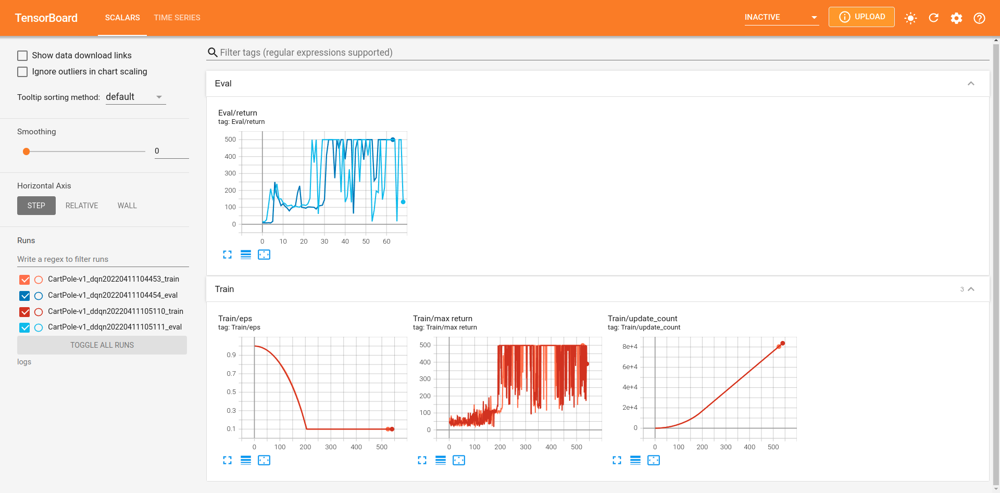

## aictrlab(AI control Lab)

-----
该项目旨在实现现有的强化学习算法

### 目前已实现算法
1. DQN https://www.nature.com/articles/nature14236
2. DDQN https://arxiv.org/abs/1509.06461
3. DDPG https://arxiv.org/abs/1509.02971

其实现过程基本上与原论文保持一致，并在此基础上加入了并行采样机制

### 性能评测
1. CartPole-v1

2. Lunar_Lander_v2

3. Acrobot_v1

